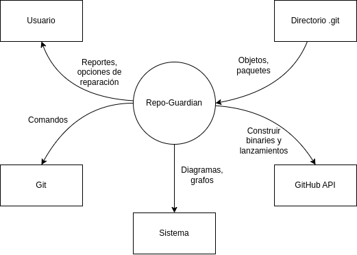

# Repo-Guardian (Hecho por Akira-13)

## Descripción

Repo-Guardian es una herramienta para solucionar problemas comunes en repositorios Git. Puede auditar, reparar y re-lineralizar cualquier repositorio.

## Motivación

Se busca automatizar tareas de reparación de repositorios cotidianas que usualmente tomarían varios comandos y un análisis que puede resultar tedioso, en especial para usuarios o desarrolladores no familiarizados con la forma en la que trabaja Git internamente.

## Comandos

- `scan`: Leer archivos en `.git/objects` y detectar si es loose o entrada de packfile.

- `inflate`: Descomprimir zlib, extraer cabecera "<type> <size>\0", recalcular hash y contrastar con nombre.

- `build-dag`: Con cada commit válido insertar vértice en un dict → lista de padres; recorrer con BFS para establecer orden topológico y generation number (GN).

- `detect-rewrite`: Para cada punta encontrada calcular string de hashes desde él hasta root, aplicar textdistance.jaro_winkler. Si ∆ ≥ 0,92 marcar como "candidato a historial re-escrito".

- `repair`: Aplicar git rebase --onto o generar secuencia de scripts git cherry-pick para re-anclar commits válidos sobre main.

- `graph`: Serializar DAG en GraphML, atributos: sha, author, timestamp, GN, status.

## Diagrama de contexto

